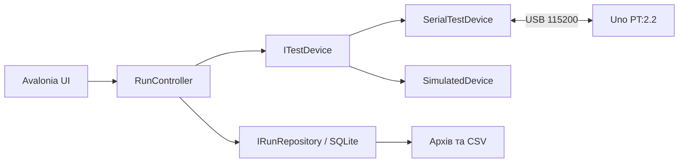

# Архітектура та розробка

[Зміст](README.md) · [Протокол](PROTOCOL.md)

Описано поточний **локальний** Engineering v0.14, а не історичні скетчі в корені GitHub. Публікація цього пакета не включає вихідний код Engineering.

## Компоненти

| Частина | Відповідальність | Основні файли в Engineering checkout |
|---|---|---|
| Core | Сесія, налаштування, модель виміру, валідація кадрів, контроль тяги | `src/PropTest.Core/RunController.cs`, `Models.cs`, `TelemetryProtocol.cs`, `ThrustGuard.cs` |
| Infrastructure | USB/serial, сумісність PT:1.0/PT:2.x, SQLite, каталог портів | `src/PropTest.Infrastructure/SerialTestDevice.cs`, `SqliteRunRepository.cs`, `SerialPortCatalog.cs` |
| Desktop | Avalonia UI, графіки, архів, CSV, вікна помилок | `src/PropTest.Desktop/MainViewModel.cs`, `TelemetryChart.cs`, `MainWindow.axaml` |
| Simulator | Синтетичний пристрій за спільним інтерфейсом | `src/PropTest.Core/SimulatedDevice.cs` |
| Firmware | Вимірювання, PWM, армінг, watchdog/heartbeat | `firmware/PropTestUno/PropTestUno.ino`, `SoundEnvelope.h` |
| Tests | Core, serial, UI, умовні апаратні перевірки | `tests/PropTest.Tests/` |



`ITestDevice` відокремлює пристрій від UI і зберігання; `IRunRepository` відокремлює сховище. Поточна модель має один відсоток газу й одну тягу на вимір — повноцінних чотирьох каналів у ній ще немає.

Стани сесії: `Disconnected`, `Connecting`, `Ready`, `Running`, `Faulted`. Підключення виконується асинхронно щодо UI. Start вимагає Ready, створює запис і починає з нульового газу. RunController серіалізує операції через lock. Втрата телеметрії, помилка пристрою або контроль тяги завершують сесію з причиною.

## Час, дані та сумісність

Модель Measurement зберігає RunId, Sequence, ElapsedMs, ThrottlePercent, nullable ThrustGrams/CurrentAmps, XYZ, ThrustRaw, SoundAdc та історичне SoundDb. Для нових PT:2.x SoundDb залишається null. Відсутнє значення не замінюється фальшивим виміром нуля.

Serial-адаптер перевіряє uptime від Uno, але у Measurement використовує час отримання на ПК. Це не синхронізоване семплювання каналів. RunController відхиляє інший RunId, повторні/старі sequence та регрес часу. TelemetryFrameDecoder підтримує часткові або об'єднані serial-рядки.

Внутрішній нормалізований формат:

```text
PT2|S|run_id|sequence|elapsed_ms|throttle_pct|thrust_g|current_a|acc_x_g|acc_y_g|acc_z_g|sound_db|thrust_raw|sound_adc
```

Це **не** формат команд або кадрів на дроті Uno. Парсер підтримує 8, 12 та 14 полів для старих записів, максимум 512 символів і лише скінченні числа. Старі дані не перераховуються мовчки; версія джерела потрібна для інтерпретації одиниць.

SQLite: таблиця `runs` з ID, часом, JSON-налаштуваннями, source, outcome та версією; таблиця `samples` із ключем `(run_id, seq)` і JSON payload. При відкритті незавершені Running позначаються Interrupted. Штатна програма використовує mutex проти одночасних екземплярів; smoke-режим має окреме сховище/ідентифікацію.

CSV v0.14: UTF-8 із BOM, кома як роздільник, інваріантний числовий формат, відсутні значення порожні. Source береться у лапки з екрануванням лапок. Колонки:

```text
run_id,source,sequence,elapsed_ms,throttle_pct,thrust_g,current_a,acc_x_g,acc_y_g,acc_z_g,sound_db_uncalibrated,thrust_raw_adc,sound_raw_adc
```

Поле `sound_db_uncalibrated` залишене для історії, не означає підтверджений SPL. Схема CSV ще не містить напруги, Wh, окремих моторних каналів або калібрувального сертифіката.

## COM і платформи

Адаптер розпізнає PT:1.0, 2.0, 2.1, 2.2. У PT:1.0 інші семантика газу й гарантії зупинки; не прирівнювати його до PT:2.2. Автоматичного переходу на довільні старі команди `s/g` немає.

Windows-автовиявлення перевіряє Arduino VID_2341/VID_2A03. Ручний вибір залишається необхідним для інших USB-UART. Перевірка USB не замінює handshake; підключення не запускає запис чи мотор автоматично. Відкриття порту може перезапустити Uno.

Avalonia та .NET мають переносні компоненти, проте поточний runtime збирання — win-x64, а Windows-каталог використовує реєстр. Linux не протестований і не заявляється підтримуваним релізом. Для нього потрібні окремі перевірки serial-доступу, діалогів, графіків та публікації.

## Збирання повного локального Engineering checkout

- Target framework: .NET 8 (`net8.0`).
- SDK у global.json: 9.0.101, rollForward latestPatch.
- Avalonia: 11.2.5.
- NuGet lock-файли зберігаються; відновлення у locked mode.

```powershell
dotnet restore PropTest.Engineering.sln --locked-mode
dotnet build PropTest.Engineering.sln -c Release --no-restore
dotnet test PropTest.Engineering.sln -c Release --no-build
powershell -File scripts/build.ps1 -Publish
```

Остання команда сама повторює restore/build/test та створює `artifacts/windows-v14`. Для звичайного повного циклу достатньо її однієї. Не вимикайте lock-файли для обходу помилок відновлення.

Апаратні тести активуються змінними на кшталт `PROPTEST_HARDWARE_PORT` і `PROPTEST_SOUND_CAPTURE`: не вмикайте їх під час звичайної перевірки документації або CI. Звичайний desktop build не прошиває Uno. Локальна Arduino-конфігурація й резервні копії не опубліковані; відтворюваний пакет збирання firmware ще потрібно підготувати.

## Межі подальшого рефакторингу

Зберегти розділення UI, сесії, пристрою та сховища. Для v2 додати реальний мережевий транспорт і версіоновані можливості пристрою, а не прив'язувати UI до ESP32 GPIO. Потрібна міграція моделі для каналів моторів і електричних величин зі збереженням старих архівів. Немає підстав зараз створювати універсальну систему плагінів для будь-якого обладнання.
