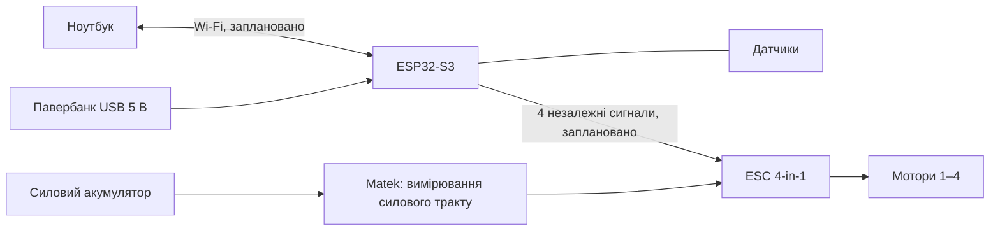

# Обладнання та вимірювання

[Зміст](README.md) · [План v2](ROADMAP.md)

## Поточний одномоторний стенд

| Компонент | Відоме | Статус/обмеження |
|---|---|---|
| Keyestudio Uno, ATmega328P | Поточний контролер | Є фото та попередні апаратні звіти |
| Sensor Shield 5.2 | Плата розведення контактів | Версія повідомлена власником |
| Hobbywing XRotor 40A | На етикетці 2–6S LiPo, No BEC | Номінал ESC не визначає допустимий струм датчика або мотора |
| Мотор 2807 1300KV | Маркування на фото | Виробник і допустимий режим не визначені; KV не є кіловатами |
| Пропелер 7×4×3R | Маркування повідомлене власником | Максимальна тяга цієї комбінації не встановлена |
| Акумулятор | Повідомлено 4S, близько 4800 мА·год; спостерігали 16,44 В | Хімія, схема елементів і допустимий струм потребують уточнення |
| Тензодатчик + HX711 | 1 кг за повідомленням власника | Паспорт і еталонна перевірка відсутні |
| ACS712 | Номінальна формула версії 20 А | Маркування та калібрування перевірити |
| MMA8452Q | Попередньо визначений за I2C 0x1D | Поточна конфігурація ±8 g, 50 Гц |
| Аналоговий мікрофон Keyestudio | Вимірюється сигнал ADC | Точна модель і акустична характеристика невідомі |

### Контакти поточної прошивки Uno

| Канал | Контакти |
|---|---|
| ESC | D9 |
| HX711 | DOUT D6, SCK D7 |
| Струм | A3 |
| Звук | A0 |
| MMA8452Q | SDA A4, SCL A5 |

Це контакти поточного `firmware/PropTestUno/PropTestUno.ino` у локальному Engineering checkout. Старі скетчі мають інші призначення; цю таблицю не можна переносити на ESP32-S3.

### Значення сигналів

- Тяга: історичний коефіцієнт близько 0,0014577025 грам-сили на відлік HX; desktop застосовує полярність −1 для цього кріплення. Це не універсальне калібрування. Написи «г» у UI описують еквівалент сили у грам-силах, а не масу повітря.
- Нуль HX оновлюється у роззброєному стані та фіксується при армінгу. Програмне обнулення не знімає фізичного навантаження з датчика.
- Струм: номінальна оцінка ACS712, впливають нуль, чутливість, опорна напруга й температура.
- Звук PT:2.1/2.2: середній розмах ADC завершених 50-мс вікон. Немає каліброваного SPL; телефонний шумомір не був підтвердженим еталоном.
- XYZ: X вперед/назад, Y вверх/вниз, Z вправо/вліво за описом власника. Гравітація не видаляється. Норма вектора не дорівнює RMS вібрації.
- Напруга банок читається зовнішнім приладом і не потрапляє в поточну програму.

## Замовлені компоненти v2

За повідомленням власника; отримання й апаратні перевірки не підтверджені.

| Компонент | Обрана конфігурація | Що перевірити після отримання |
|---|---|---|
| ESP32-S3-WROOM-1 N16R8 development board | 16 MB Flash, 8 MB PSRAM, два USB-C, PCB-антена за описом продавця | Маркування, пам'ять, USB-розведення, доступні GPIO |
| BrotherHobby Returner 55A V1 4-in-1 | Виробник заявляє 3–6S, DShot300/600, 55 А на канал | Точну ревізію, pinout, рівні сигналів, прошивку, охолодження |
| Matek I2C-INA-BM | I2C-монітор струму/напруги | INA228 чи INA238, шунт, адресу, живлення, підтяжки I2C |

Для Matek раніше перевірена специфікація виробника вказувала шунт 200 мкОм, діапазон 204,8 А та 150 А тривалого струму. Це паспортні дані модуля, не перевірені межі нашої проводки. Фактичну ревізію потрібно звірити з актуальною документацією. Єдина плата перед 4-in-1 вимірює сумарний струм, не струм кожного мотора окремо.

Плата ESP32 DevKit V1 із попереднього замовлення не є цільовою конфігурацією: власник повідомив про замовлення ESP32-S3. Скасування старого замовлення не перевірялося.

## Схема напрямку v2 — не монтажне креслення

Окремої кнопки ON/OFF електроніки у поточному плані немає. Живлення подається/знімається USB-кабелем від павербанка; USB ноутбука залишається сервісним варіантом. Одночасне підключення джерел не погоджене до перевірки плати. Роздільні джерела не означають гальванічної ізоляції: опорну землю, зворотне живлення та 3,3/5 В потрібно опрацювати у монтажній схемі.

Павербанк перевіряється на самовимкнення при малому споживанні. Мотори від нього не живляться. Незалежне аварійне відключення силового тракту ще не спроєктовано; воно не тотожне кнопці живлення контролера.

## Чотири датчики тяги

Для паралельних сил одного напрямку: `Ftotal = F1 + F2 + F3 + F4`, де всі F — узгоджені в часі, відкалібровані сили в однакових одиницях після врахування нуля. Умовний приклад: 500 + 520 + 490 + 510 гс = 2020 гс = 2,02 кгс. Це не результат випробування.

Якщо кожен мотор має власний механічно відокремлений вимірювальний тракт, можна отримати його тягу. Якщо спільна рама спирається на чотири датчики, сума реакцій після врахування ваги може дати загальну вертикальну тягу в квазістатичному режимі, але окремий датчик не визначає тягу найближчого мотора. Паразитні опори, кабелі, інерція та перекоси впливають на результат.

Номінали 5 кг обговорювалися, але не затверджені й не замовлені за наявними даними. Обирають за найбільшим навантаженням на один датчик, вагою кріплення, геометрією та динамікою. Чотири датчики по 1 кг не гарантують допустимі 4 кг сумарно. Більший діапазон сам по собі не підвищує точність.

## Джерела компонентів

- [Espressif: DevKitC-1](https://docs.espressif.com/projects/esp-dev-kits/en/latest/esp32s3/esp32-s3-devkitc-1/user_guide_v1.1.html): довідка платформи, не доказ ідентичності придбаної сторонньої плати.
- [BrotherHobby: 55A V1](https://www.brotherhobbystore.com/products/3-6s-8bit-55a4in1-esc-v1).
- [Matek: I2C-INA-BM](https://www.mateksys.com/?portfolio=i2c-ina-bm).
- [Замовлена ESP32-S3, картка товару](https://prom.ua/ua/p3126879775-plata-razrabotki-esp32.html).

Специфікації продавців і виробників є зовнішніми джерелами, не протоколом випробувань PROpTEST.
